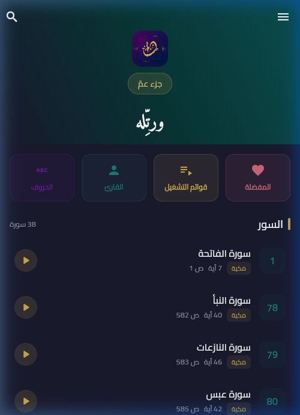
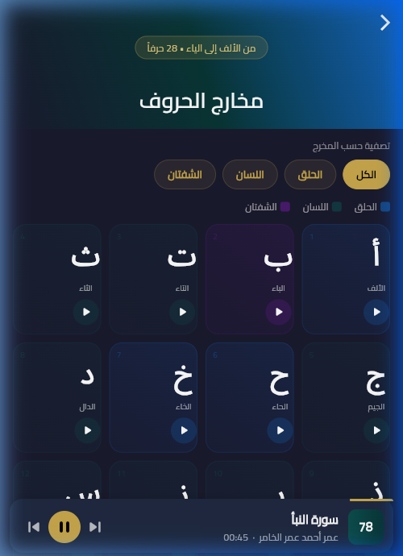
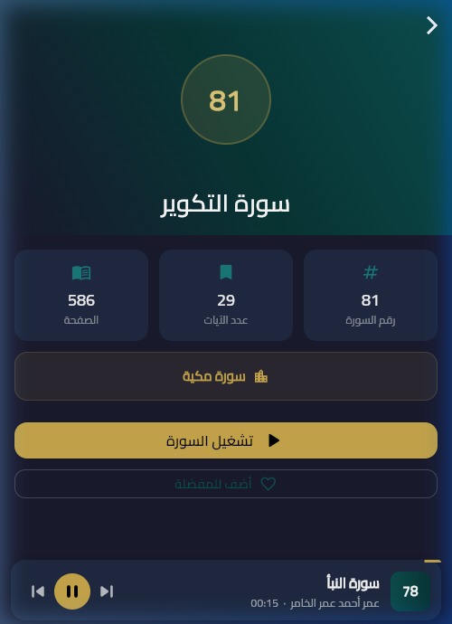
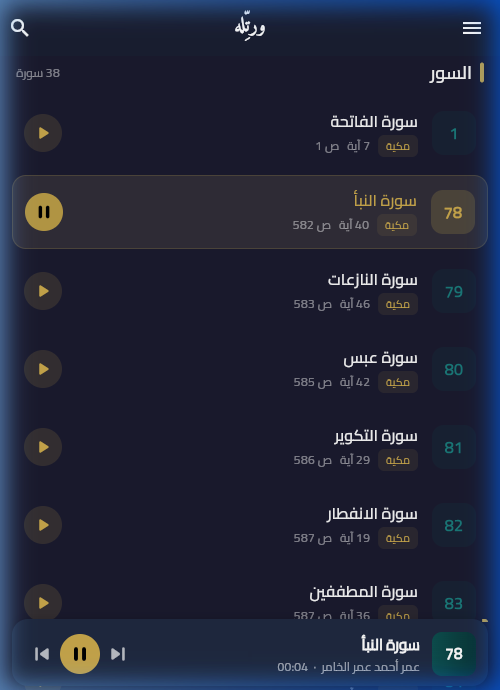
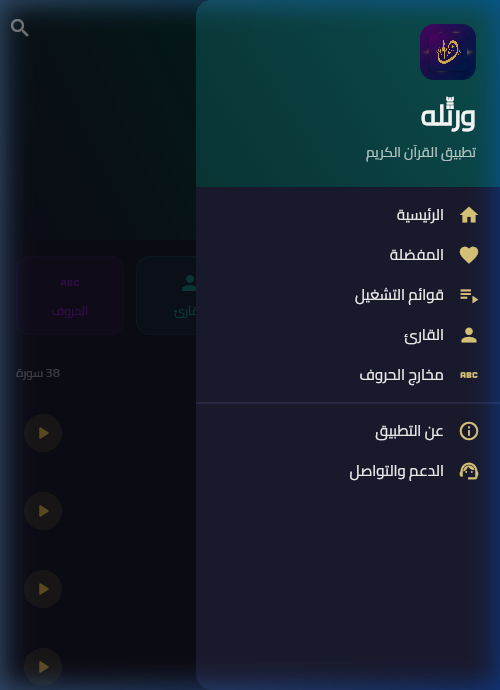

# ورتِّله (Warattilhu) - تطبيق القرآن الكريم

"ورتِّله" هو تطبيق إسلامي متكامل للقرآن الكريم، مصمم لتوفير تجربة استماع وقراءة روحانية مريحة وبديهية، مع التركيز على الواجهة الجمالية والأداء السلس. التطبيق يتيح للمستخدمين الاستماع لتلاوات القرآن الكريم (جزء عمّ) والتعرف على مخارج الحروف العربية.

## 🌟 المميزات الأساسية

- **الاستماع للقرآن الكريم (جزء عمّ):** تلاوات صوتية نقية بجودة عالية.
- **مخارج الحروف:** قسم تعليمي مخصص للحروف العربية الـ28 مع استشهاد صوتي لكل مخرج بالقرآن.
- **مشغل صوتي متقدم:** تشغيل في الخلفية، تحكم كامل من شاشة القفل، وميني بلاير (Mini Player) دائم الظهور.
- **المفضلة وقوائم التشغيل:** إمكانية حفظ السور المفضلة وإنشاء قوائم تشغيل مخصصة.
- **التشغيل بدون إنترنت (مستقبلاً):** الملفات الصوتية مدمجة مع التطبيق ومضغوطة لتقليل حجم التطبيق (حوالي 49 ميجابايت لـ 66 ملفاً صوتياً).
- **واجهة مستخدم عصرية:** تصميم Dark Mode أنيق، دعم كامل للغة العربية (RTL)، وألوان مريحة للعين.

## 🛠 التقنيات المستخدمة

تم بناء التطبيق باستخدام إطار عمل **Flutter** لتوفير أداء ممتاز على منصات متعددة (Android, iOS, Web).

- **Flutter / Dart:** لغة البرمجة الأساسية وبناء واجهة المستخدم.
- **Riverpod (`flutter_riverpod`):** لإدارة الحالة (State Management) المتقدمة.
- **Go Router (`go_router`):** للتنقل السلس والآمن بين شاشات التطبيق.
- **Just Audio (`just_audio`):** لتشغيل الملفات الصوتية بكفاءة عالية وإدارة قوائم التشغيل.
- **Audio Service (`audio_service`):** لربط المشغل الصوتي بنظام التشغيل ليظل يعمل في الخلفية وشاشة القفل.
- **Hive (`hive_flutter`):** قاعدة بيانات سريعة (NoSQL) لحفظ المفضلة وقوائم التشغيل وإعدادات المستخدم محلياً.

## 📂 هيكلية المشروع

يعتمد التطبيق على معمارية تعتمد على الميزات (Feature-Based Architecture):

- `lib/core/`: يحتوي على الإعدادات المشتركة كالتيمات، الراوتر، والألوان.
- `lib/data/`: يحتوي على النماذج (Models) ومصادر البيانات (Data Sources) كملفات السور والحروف.
- `lib/features/`: كل مجلد هنا يمثل ميزة مستقلة (Home, Player, Arabic Alphabet, Favorites...).
- `assets/audio/`: يحتوي على الملفات الصوتية المضغوطة (بصيغة `64kbps mono MP3`) مقسمة لـ `juz_amma` و `arabic_alphabet`.

## 🚀 كيفية التشغيل والتطوير

1. تأكد من تثبيت [Flutter SDK](https://docs.flutter.dev/get-started/install) بإصداره الأخير.
2. قم بتحميل المستودع:

   ```bash
   git clone https://github.com/bootfi/rattil-mobile.git
   ```

3. قم بتثبيت الاعتمادات:

   ```bash
   flutter pub get
   ```

4. تشغيل التطبيق (مثال للويب أو الجوال):

   ```bash
   flutter run
   ```

## ✨ أحدث الإضافات والتحديثات (Changelog)

- **سورة الفاتحة:** إضافة سورة الفاتحة كأول سورة مسجلة للشيخ بجودة محسّنة ومضغوطة.
- **نبذة القارئ:** توثيق إجازة القارئ في صفحة المعلومات ("مجاز بالقراءات السبع من معهد ابن عباس بالمكلا").
- **تحسينات الحروف (مخارج الحروف):** التمييز الذكي في المشغل الصوتي بين "السورة" و"الحرف"، وإخفاء أرقام الصفحات عند تشغيل الحروف.
- **ضغط الصوتيات:** إعادة ضغط كافة الملفات الصوتية (السور والحروف) إلى جودة `64kbps Mono`، مما أدى لتقليل حجم الصوتيات من 240 ميجابايت إلى حوالي 49 ميجابايت (تقليل الحجم بأكثر من 79%).
- **الهوية البصرية:** توفير أيقونة إسلامية جديدة واحترافية (App Icon).
- **دعم الويب:** إضافة إعدادات التشغيل للويب (Chrome) وإصلاح مشاكل التوطين (Localization) على المتصفح.

## 📸 صور من داخل التطبيق (Screenshots)

<div align="center">
  
  
  
</div>
<br>
<div align="center">
  
  
</div>

### 🎥 فيديو تجريبي (App Demo)


